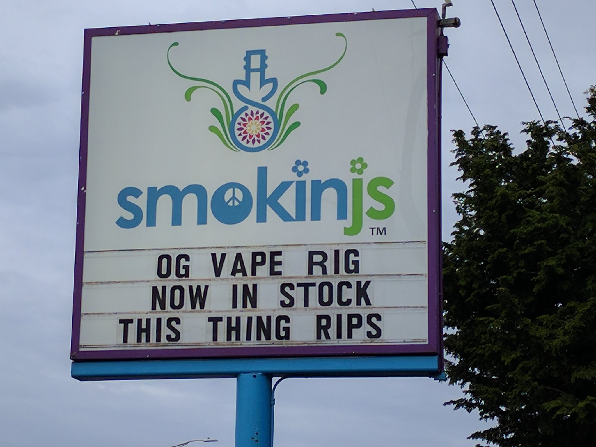

# smokinjs
This thing rips

## what?
This just binds `$_$` to `querySelectorAll`, so that you can do shit like

```javascript
import { $_$ } from 'smokinjs';

const emptyEditor = () => $_$('#editor').innerHTML = '';
```

es6 exported.  now in stock

## what?
I saw their logo, and I knew what I had to do

[](http://smokinjs.com/)

## what?
stop it

## what?
